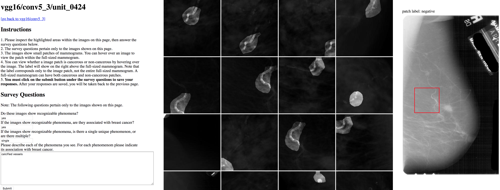

# ddsm-visual-primitives

This code release accompanies the following two papers:

### Expert identification of visual primitives used by CNNs during mammogram classification [[arXiv](https://arxiv.org/abs/1803.04858)]

Jimmy Wu, Diondra Peck, Scott Hsieh, Vandana Dialani, Constance D. Lehman, Bolei Zhou, Vasilis Syrgkanis, Lester Mackey, Genevieve Patterson

*SPIE Medical Imaging 2018*

**Abstract:** This work interprets the internal representations of deep neural networks trained for classification of diseased tissue in 2D mammograms. We propose an expert-in-the-loop interpretation method to label the behavior of internal units in convolutional neural networks (CNNs). Expert radiologists identify that the visual patterns detected by the units are correlated with meaningful medical phenomena such as mass tissue and calcificated vessels. We demonstrate that several trained CNN models are able to produce explanatory descriptions to support the final classification decisions. We view this as an important first step toward interpreting the internal representations of medical classification CNNs and explaining their predictions.

### DeepMiner: Discovering Interpretable Representations for Mammogram Classification and Explanation [[arXiv](https://arxiv.org/abs/1805.12323)]

Jimmy Wu, Bolei Zhou, Diondra Peck, Scott Hsieh, Vandana Dialani, Lester Mackey, Genevieve Patterson

**Abstract:** We propose DeepMiner, a framework to discover interpretable representations in deep neural networks and to build explanations for medical predictions. By probing convolutional neural networks (CNNs) trained to classify cancer in mammograms, we show that many individual units in the final convolutional layer of a CNN respond strongly to diseased tissue concepts specified by the BI-RADS lexicon. After expert annotation of the interpretable units, our proposed method is able to generate explanations for CNN mammogram classification that are correlated with ground truth radiology reports on the DDSM dataset. We show that DeepMiner not only enables better understanding of the nuances of CNN classification decisions, but also possibly discovers new visual knowledge relevant to medical diagnosis.



## Overview

Directory | Purpose
------|--------
[`data`](data) | DDSM data
[`db`](db) | DB module for interacting with DB for persisting annotations and network characteristics
[`training`](training) | CNN training and evaluation code
[`server`](server) | Flask server code for expert annotation web interface

## Project Setup

The subdirectories [`training`](training) and [`server`](server) contain original and for the most part unchanged READMEs from the original DeepMiner trunk project.
You can refer to these for detailed information on how to interact with either component.
For the first time setup and general use of the project as is, this subsection is you one-stop-shop.

### Clone Project and Setup IDE

You can clone this project to your local machine as usual.
You may want to build and run the project on a remote server however for continuous availability of the server application as well as due to long-running scripts and/or training.
Such a setup using the PyCharm IDE is explained in this section.

1. After cloning, open the local project using the PyCharm IDE
2. Add a remote deployment to your remote server by going to `Tools -> Deployment -> Configuration...`
  1. Add a new configuration using the `+` symbol in the top-left
  2. Choose `SFTP` as the connection type and an arbitrary name
  3. Use your host address and SSH port (22), and SSH credentials (e.g. username and password) and test the connection
  4. You can set a default root path for your deployments, this what all file paths will be relative to when project files are uploaded to your host during deployment
3. Right click your the project name (`ddsm-visual-primitives`) in the Project window, choose `Deployment` and `Upload to <your host>`
4. Create Run configurations for the server application and various prerequisite scripts as per the following table (make sure to always use your *Remote Python* interpreter for all run configurations, and check *Add content roots to PYTHONPATH* and *ADD source roots to PYTHONPATH*)

| Configuration Name | Type | Target | Additional Options | Environment Variables | Working Directory |
| :------------- | :------------- | :------------- | :------------- | :---- | :---- |
| server | Flask server | `server` | `-h 0.0.0.0` | `FLASK_APP=server.py;FLASK_RUN_PORT=1221` | `<proj~>/server` |
| analyze_full_images | Python | `<proj~>/training/analyze_full_images.py` | `--config_path=../training/logs/<latest_model>/config.yml` | `PYTHONUNBUFFERED=1` | `<proj~>/training` |
| analyze_patches | Python | `<proj~>/training/analyze_patches.py` | `--config_path=../training/logs/<latest_model>/config.yml` | `PYTHONUNBUFFERED=1` | `<proj~>/training` |
| analyze_patches | Python | `<proj~>/training/analyze_patches.py` | `--config_path=../training/logs/<latest_model>/config.yml` | `PYTHONUNBUFFERED=1` | `<proj~>/training` |
| fix_full_images | Python | `<proj~>/training/fix_full_images.py` | | `PYTHONUNBUFFERED=1` | `<proj~>/training` |
| train_patches | Python | `<proj~>/training/train_patches.py` | `--config_path=../training/logs/<latest_model>/config.yml` | `PYTHONUNBUFFERED=1` | `<proj~>/training` |

The `FLASK_RUN_PORT` will be the port under which you will be able visit the server application on your server.

### Download and extract DDSM data

The DDSM data is not bundled in this repo for obvious size considerations. You can download and extract the data using the `download_data.sh` script.
Note, that instead of downloading the DDSM data to you local machine and then pushing it to your remote host using SFTP, you likely will want to download the data onto your remote host straight away by running the script there.
The download and extraction can take up to an hour, also depending on the speed of your internet connection, so you might want to start a `screen` session when executing it via an ssh connection in case of a disconnect.

### Train or use Pre-trained Neural Network

You can train a new neural network on the DDSM data using the `train_patches` Run configuration created earlier.
*Alternatively*, you can also use a pre-trained network.

### Run Prerequisite Scripts

Before starting up the server for the first time you will need to run the following scripts using the Run Configurations created earlier; `analyze_patches`, `analyze_full_images`, and `fix_full_images`.

### Start Server for Unit Visualizations and Annotations

You can start the server on your remote host using the `server` Run configuration described earlier.

## Citation

If you find our work useful for your research, please consider citing:

```
@proceeding{doi: 10.1117/12.2293890,
author = {Jimmy Wu, Diondra Peck, Scott Hsieh, Vandana Dialani, Constance D. Lehman, Bolei Zhou, Vasilis Syrgkanis, Lester Mackey, Genevieve Patterson},
title = {Expert identification of visual primitives used by CNNs during mammogram classification},
journal = {Proc.SPIE},
volume = {10575},
pages = {10575 - 10575 - 9},
year = {2018},
doi = {10.1117/12.2293890},
URL = {https://doi.org/10.1117/12.2293890},
}
```

```
@article{wu2018deepminer,
title={DeepMiner: Discovering Interpretable Representations for Mammogram Classification and Explanation},
author={Wu, Jimmy and Zhou, Bolei and Peck, Diondra and Hsieh, Scott and Dialani, Vandana and Mackey, Lester and Patterson, Genevieve},
journal={arXiv preprint arXiv:1805.12323},
year={2018}
}
```
